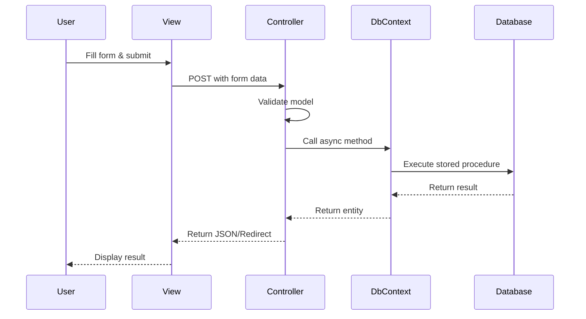

## Introduction

Quejas Ciudadanas is a citizen complaint management system built with ASP.NET Core 8.0 using the Model-View-Controller (MVC) architectural pattern. The application enables citizens to report infrastructure issues and allows government agents to track and respond to these complaints.

## Technology Stack

<CardGroup cols={2}>
  <Card title="Framework" icon="code">
    ASP.NET Core 8.0 with MVC pattern
  </Card>
  <Card title="Database" icon="database">
    SQL Server with Entity Framework Core 9.0.4
  </Card>
  <Card title="Frontend" icon="browser">
    Razor Views with Bootstrap and jQuery
  </Card>
  <Card title="Authentication" icon="lock">
    Session-based authentication with custom filters
  </Card>
</CardGroup>

## System Architecture

The application follows a traditional three-tier architecture:

```
┌─────────────────────────────────────────────────┐
│          Presentation Layer (Views)             │
│  - Razor Views (.cshtml)                       │
│  - Static files (CSS, JS, Images)             │
└─────────────────────────────────────────────────┘
                      ↕
┌─────────────────────────────────────────────────┐
│       Business Logic Layer (Controllers)        │
│  - HomeController (Authentication)             │
│  - ReportesController (Reports & Cases)        │
│  - Action Filters (Session Verification)       │
└─────────────────────────────────────────────────┘
                      ↕
┌─────────────────────────────────────────────────┐
│         Data Access Layer (Models/Data)         │
│  - Entity Framework DbContext                  │
│  - Models (Entities)                           │
│  - Stored Procedures Integration               │
└─────────────────────────────────────────────────┘
                      ↕
┌─────────────────────────────────────────────────┐
│              SQL Server Database                │
│  - Tables, Views, Stored Procedures            │
└─────────────────────────────────────────────────┘
```

## Project Structure

The solution is organized into the following key directories:

<CodeGroup>
```bash Project Root
quejas_ciudadanas/
├── Controllers/          # MVC Controllers
│   ├── HomeController.cs
│   └── ReportesController.cs
├── Models/              # Data models and entities
│   ├── clases_catalogo.cs
│   ├── clases_enviadas_consultas.cs
│   └── clases_recibidas_consultas.cs
├── Views/               # Razor views
│   ├── Home/
│   ├── Reportes/
│   └── Shared/
├── Data/                # Database context
│   └── QuejasCiudadanasContext.cs
├── Filtros/             # Custom action filters
│   └── VerificaSesionAttribute.cs
├── wwwroot/             # Static files
│   ├── css/
│   ├── js/
│   ├── evidencias/      # User-uploaded photos
│   └── evidencias_respuesta_caso/  # Agent responses
├── Program.cs           # Application entry point
└── appsettings.json     # Configuration
```
</CodeGroup>

## Key Components

### Application Startup (Program.cs)

The application is configured in `Program.cs` with the following key services:

<CodeGroup>
```csharp Program.cs Configuration
var builder = WebApplication.CreateBuilder(args);

// Database connection
var connectionString = builder.Configuration.GetConnectionString("QuejasCiudadanaDb");
builder.Services.AddDbContext<QuejasCiudadanasContext>(options =>
    options.UseSqlServer(connectionString));

// MVC services
builder.Services.AddControllersWithViews();

// Session management
builder.Services.AddSession(options =>
{
    options.IdleTimeout = TimeSpan.FromMinutes(30);
    options.Cookie.HttpOnly = true;
    options.Cookie.IsEssential = true;
});

// HTTP context accessor
builder.Services.AddHttpContextAccessor();
```
</CodeGroup>

<Info>
The session timeout is configured for 30 minutes of inactivity. Sessions are essential for maintaining user authentication state throughout the application.
</Info>

## Request Processing Flow

<Steps>
  <Step title="User Request">
    A user navigates to a URL (e.g., `/Reportes/Index`)
  </Step>
  
  <Step title="Routing">
    ASP.NET Core routing matches the URL to a controller action based on the default route pattern: `{controller=Home}/{action=Index}/{id?}`
  </Step>
  
  <Step title="Action Filter">
    Custom `[VerificaSesion]` attribute checks if the user has an active session. If not, redirects to login.
  </Step>
  
  <Step title="Controller Action">
    The controller action executes, interacting with the database through `QuejasCiudadanasContext`
  </Step>
  
  <Step title="View Rendering">
    The controller returns a view with data, which is rendered as HTML using Razor syntax
  </Step>
  
  <Step title="Response">
    The rendered HTML is sent back to the user's browser
  </Step>
</Steps>

## Data Flow Patterns

### Form Submission Flow



### File Upload Flow

The application handles two types of file uploads:

1. **Citizen Reports** - Photos of infrastructure issues
2. **Agent Responses** - Photos and PDF documents

<Note>
Files are stored in the `wwwroot` directory with a structured naming convention that includes case ID, report ID, user ID, and a unique key to prevent conflicts.
</Note>

## Security Features

<CardGroup cols={2}>
  <Card title="Session-Based Auth" icon="shield-check">
    Custom `VerificaSesionAttribute` filter protects controller actions from unauthorized access
  </Card>
  
  <Card title="SQL Parameterization" icon="code">
    All database queries use `SqlParameter` objects to prevent SQL injection attacks
  </Card>
  
  <Card title="HTTPS Enforcement" icon="lock">
    Production environment enforces secure connections
  </Card>
  
  <Card title="Cookie Security" icon="cookie">
    Session cookies are HttpOnly and marked as essential
  </Card>
</CardGroup>

## API Endpoints

The application exposes several JSON endpoints for AJAX interactions:

| Endpoint | Method | Purpose | Authentication |
|----------|--------|---------|----------------|
| `/Reportes/GetClasesProblema` | GET | Fetch problem classes by problem ID | Required |
| `/Reportes/GetTiposProblema` | GET | Fetch problem types by class ID | Required |
| `/Reportes/ObtenerCiudades` | GET | Fetch cities by department code | Required |
| `/Reportes/consultar_reportes` | POST | Search reports with filters | Required |
| `/Reportes/consultar_caso_x_report` | POST | Get case details | Required |
| `/Home/inicio_secion` | POST | User login | Public |
| `/Home/nuevo_usuario` | POST | User registration | Public |

## Configuration

The application uses standard ASP.NET Core configuration with:

- **appsettings.json** - Contains connection strings and logging configuration
- **appsettings.Development.json** - Development-specific overrides
- **Environment Variables** - Can override any configuration setting

<CodeGroup>
```json appsettings.json Structure
{
  "ConnectionStrings": {
    "QuejasCiudadanaDb": "[SQL Server connection string]"
  },
  "Logging": {
    "LogLevel": {
      "Default": "Information",
      "Microsoft.AspNetCore": "Warning"
    }
  },
  "AllowedHosts": "*"
}
```
</CodeGroup>

## Performance Considerations

<CardGroup cols={2}>
  <Card title="Async Operations" icon="bolt">
    All database operations use `async/await` pattern to prevent thread blocking
  </Card>
  
  <Card title="Response Caching" icon="clock">
    Error pages use `[ResponseCache]` attribute with no caching to ensure fresh error information
  </Card>
  
  <Card title="Static Files" icon="file">
    Static content served directly from `wwwroot` with efficient caching headers
  </Card>
  
  <Card title="Connection Pooling" icon="database">
    Entity Framework Core manages database connection pooling automatically
  </Card>
</CardGroup>

## Next Steps

<CardGroup cols={2}>
  <Card title="MVC Structure" icon="folder-tree" href="/architecture/mvc-structure">
    Learn about Controllers, Views, and Models in detail
  </Card>
  
  <Card title="Database Schema" icon="table" href="/architecture/database-schema">
    Explore the database structure and relationships
  </Card>
</CardGroup>